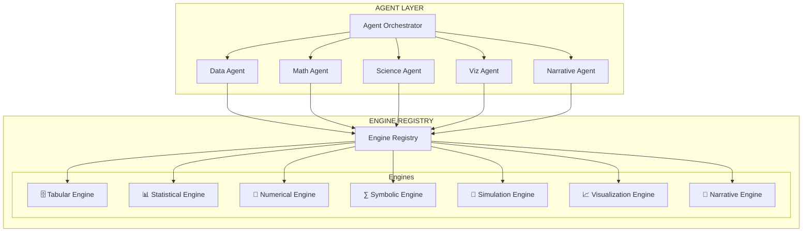

# Lattice — Agent-Native Universal Computation Platform

> *From a child's homework to a rocket scientist's orbital mechanics. One platform. Zero formulas to learn.*

---

## The Insight

Excel, Power BI, MATLAB, R, Jupyter — each is powerful, but each requires **humans to learn a language** (formulas, DAX, M, Python, R) and **manually operate a UI** to access computation. The complexity of these tools exists because humans were the operators.

In 2026, AI agents can write formulas, build models, solve equations, and compose visualizations better than most human operators. The entire UI/syntax layer that made these tools hard to build and hard to learn **becomes unnecessary**.

**Lattice is what you get when you separate computation from interface, let engines do the math, and let agents run the engines.**

---

## Core Architecture: Engines + Agents

This is the foundational design principle. Two layers, clean separation:

```
┌─────────────────────────────────────────────────────────────┐
│                     AGENT LAYER                              │
│  Agents understand intent, plan workflows, compose engines   │
│  They are the intelligence — they decide WHAT to compute     │
├─────────────────────────────────────────────────────────────┤
│                     ENGINE LAYER                             │
│  Engines perform computation, return structured results      │
│  They are the muscle — they know HOW to compute              │
└─────────────────────────────────────────────────────────────┘
```

**Engines don't understand users. Agents don't do math. Each layer does what it's best at.**

---

## The Engine Registry

Seven specialized compute engines, each with a unified interface:



### The Unified Engine Interface

Every engine conforms to the same contract:

```typescript
interface Engine {
  id: string;                          // 'tabular', 'statistical', etc.
  name: string;
  capabilities: string[];              // What this engine can do
  
  execute(request: EngineRequest): Promise<EngineResult>;
  validate(request: EngineRequest): ValidationResult;
  describe(): EngineManifest;          // Self-description for agents
}

interface EngineRequest {
  operation: string;                   // Engine-specific operation name
  params: Record<string, unknown>;     // Operation parameters
  data?: DataReference;                // Input data (if needed)
  options?: Record<string, unknown>;   // Engine-level options
}

interface EngineResult {
  engineId: string;
  operation: string;
  status: 'success' | 'error';
  output: {
    data?: any;                        // Structured result data
    visualization?: VizSpec;           // Chart/plot specification
    equation?: string;                 // LaTeX equation
    narrative?: string;                // Text output
    metadata: Record<string, unknown>; // Execution stats, confidence, etc.
  };
  code: string;                        // The actual code that ran (transparency)
  durationMs: number;
}
```

### Engine Taxonomy

---

#### 🗄️ Tabular Engine

**Purpose**: Structured data operations — the Excel/Power BI layer.

| Capability | Example |
|---|---|
| Query & filter | "Show orders where revenue > $1000" |
| Aggregation | "Total revenue by region by quarter" |
| Joins | "Merge customers with orders on customer_id" |
| Pivots | "Pivot sales by product and month" |
| Window functions | "Running average of daily sales" |
| ETL transforms | "Clean nulls, standardize dates, deduplicate" |

**Powered by**: DuckDB (in-process columnar OLAP)
**Why DuckDB**: Handles millions of rows, SQL-native, no external database, queries CSV/Parquet/JSON directly.

---

#### 🧹 Data Quality Engine

**Purpose**: Data cleaning, validation, and profiling — the unglamorous work that makes everything else reliable.

| Capability | Example |
|---|---|
| Null handling | Fill, drop, interpolate missing values |
| Deduplication | Find and remove duplicate rows |
| Type coercion | Fix mixed types ("$1,200" → 1200.00) |
| Outlier detection | Flag statistical outliers, let user decide |
| Standardization | Normalize date formats, currency symbols, casing |
| Validation rules | "Email column must match pattern", "Age must be 0–150" |
| Data profiling | Completeness %, distribution, cardinality per column |

**Powered by**: DuckDB (SQL transforms) + Pyodide (statistical profiling)

---

#### 🔍 Data Inspection Engine

**Purpose**: See your data at every stage — raw, semi-processed, and fully transformed. The "show me what I'm working with" layer.

| Capability | Example |
|---|---|
| Raw data preview | First/last N rows, scrollable grid, full fidelity |
| Schema browser | Column names, types, nullability, sample values |
| Column profiling | Histograms, value distributions, top-N values |
| Data diff | "What changed between raw and cleaned?" side-by-side |
| Stage snapshots | View data at any point in the processing pipeline |
| Search & filter | Find specific values, patterns, anomalies in raw data |

**Powered by**: DuckDB (querying) + Visualization Engine (rendering)

---

#### 📊 Statistical Engine

**Purpose**: Statistical modeling and machine learning — the data scientist's toolkit.

| Capability | Example |
|---|---|
| Descriptive stats | Mean, median, std dev, quartiles, distributions |
| Regression | Linear, logistic, polynomial, multivariate |
| Hypothesis testing | t-test, chi-squared, ANOVA, p-values |
| Clustering | K-means, DBSCAN, hierarchical |
| Classification | Random forest, SVM, logistic |
| Time series | ARIMA, exponential smoothing, decomposition |
| Forecasting | Predict next N periods with confidence intervals |

**Powered by**: Pyodide (scikit-learn, statsmodels, pandas)
**Output format**: Model summary (coefficients, R², p-values) + residual plots + prediction data.

---

#### 🔢 Numerical Engine

**Purpose**: Numerical methods and scientific computing — the MATLAB replacement.

| Capability | Example |
|---|---|
| Linear algebra | Matrix operations, eigenvalues, SVD, least squares |
| Differential equations | ODE/PDE solvers (Euler, Runge-Kutta, adaptive) |
| Optimization | Minimize/maximize functions, constrained optimization |
| Interpolation | Spline fitting, polynomial interpolation |
| Integration | Numerical quadrature, definite/indefinite integrals |
| Signal processing | FFT, filtering, spectral analysis |
| Root finding | Newton's method, bisection, Brent's method |

**Powered by**: Pyodide (NumPy, SciPy)
**Output format**: Solution arrays + convergence data + plots.

---

#### ∑ Symbolic Engine

**Purpose**: Symbolic mathematics — the Wolfram Alpha / Mathematica layer.

| Capability | Example |
|---|---|
| Algebraic simplification | Simplify expressions, factor, expand |
| Calculus | Derivatives, integrals (exact), limits, series |
| Equation solving | Solve for x, systems of equations |
| LaTeX rendering | Pretty-print any mathematical expression |
| Proof verification | Verify algebraic identities |
| Unit conversion | "Convert 5 miles to kilometers" |

**Powered by**: Pyodide (SymPy)
**Output format**: LaTeX equations + step-by-step solutions + symbolic results.

---

#### 🎲 Simulation Engine

**Purpose**: Stochastic and iterative modeling — the what-if machine.

| Capability | Example |
|---|---|
| Monte Carlo | Portfolio risk (VaR), option pricing, uncertainty ranges |
| Sensitivity analysis | "What if raw material cost increases 20%?" |
| Scenario modeling | Best/worst/base case projections |
| Agent-based simulation | Market dynamics, epidemiology, traffic flow |
| Bootstrap resampling | Confidence intervals without distribution assumptions |

**Powered by**: Pyodide (NumPy random + custom iteration loops)
**Output format**: Distribution histograms + percentile tables + scenario comparisons.

---

#### 📈 Visualization Engine

**Purpose**: Transform data into interactive visual representations.

| Capability | Example |
|---|---|
| Standard charts | Line, bar, scatter, pie, area, histogram |
| Statistical plots | Box plot, violin, Q-Q plot, residual plot |
| Geospatial | Choropleth maps, point maps |
| Network graphs | Relationship diagrams, dependency trees |
| Heatmaps | Correlation matrices, time-density |
| Dashboards | Multi-chart composed layouts |

**Powered by**: Observable Plot + D3.js (client-side rendering)
**Output format**: Declarative chart specification (JSON) → rendered on Canvas.

---

#### 📝 Narrative Engine

**Purpose**: Generate human-readable text from computational results.

| Capability | Example |
|---|---|
| Data summaries | "Your dataset has 12,847 rows covering Oct-Dec 2025..." |
| Insight extraction | "APAC grew 34% — strongest region. EMEA dipped in Nov." |
| Executive reports | Structured report with sections, key findings |
| Methodology notes | "A linear regression was fitted using OLS..." |
| Anomaly explanations | "Revenue dropped 40% on Nov 15 — coincides with system outage" |

**Powered by**: LLM (via Vercel AI SDK)
**Output format**: Markdown text + structured insight objects.

---

### Engine Composability

The real power is **chaining engines**. Agents compose multi-engine workflows:

```
"Forecast next quarter's revenue by region with confidence intervals"

Agent plan:
  1. Tabular Engine  → Query historical revenue by region by month
  2. Statistical Engine → Fit ARIMA model per region, forecast 3 months
  3. Simulation Engine → Bootstrap confidence intervals (10,000 iterations)  
  4. Visualization Engine → Line chart with forecast + CI bands
  5. Narrative Engine → "APAC is projected to grow 12%..."
```

```
"Is there a statistically significant relationship between marketing spend and conversions?"

Agent plan:
  1. Tabular Engine  → Join marketing_spend + conversions on date
  2. Statistical Engine → Pearson correlation + linear regression
  3. Statistical Engine → Hypothesis test (H0: no relationship)
  4. Visualization Engine → Scatter plot with regression line + p-value annotation
  5. Narrative Engine → "Yes, significant positive correlation (r=0.73, p<0.001)..."
```

```
"Solve d²y/dx² + 4y = cos(x) and show the solution"

Agent plan:
  1. Symbolic Engine → Solve ODE symbolically → closed-form solution
  2. Numerical Engine → Verify numerically with Runge-Kutta
  3. Visualization Engine → Plot symbolic vs numerical comparison
  4. Narrative Engine → "The general solution is y = ..."
```

---

## Computation Ledger (Step-by-Step Computing)

> [!IMPORTANT]
> **Core concept, specifics TBD.** This section captures the intent. Design details will be refined once the engine layer is functional and we can see what steps actually look like in practice.

### The Problem

Even when the system *can* produce a final answer in one shot, most users want to **work step by step** — see each transformation, each intermediate result, each decision point. Steps are not chat messages; they are **computational artifacts** with inputs, outputs, and the logic connecting them.

### The Persistence Dilemma

- **Temporary memory (session/RAM)**: Too fragile — close the tab, lose everything.
- **Permanent storage (all steps forever)**: Too heavy — drowns in billions of intermediate calculations.
- **What we actually need**: A middle ground where steps persist intelligently.

### Intended Design Direction

**"Step" as a first-class object** — every computation the system performs is a Step with:
- Input (what went in)
- Operation (what engine ran, what code executed)
- Output (what came out)
- Parent step link (what step preceded this one — forming chains)

**Tiered retention** (model TBD):
- Steps are always captured during a session
- Important steps persist beyond the session
- Intermediate/exploratory steps can be pruned
- Users can pin steps to keep them permanently
- The system could auto-classify step importance based on signals (user interaction, canvas output, dead-end vs. productive)

**UI implications** (to be designed):
- Canvas shows step chains, not just final outputs
- Users can navigate back to any step, modify it, and see downstream effects
- Steps are visual, interactive, and navigable — not just a log

### Open Questions (for future design)
- Exact storage tiers and retention policies
- Step branching model (fork at step 3, explore two paths)
- Step chain visualization on canvas
- Compression/summarization of archived step chains
- How agents decide which steps are "important"

---

## Execution Preview (Plan → Review → Execute → Review)

> [!IMPORTANT]
> For complex operations, the system **does not execute blindly**. It shows a full execution plan, lets the user review and edit it, then shows output preview before finalizing.

### The Core Workflow

```
┌─────────────────────────────────────────────────────────────┐
│                    EXECUTION LIFECYCLE                        │
│                                                             │
│  ① PLAN          ② REVIEW         ③ EXECUTE      ④ OUTPUT   │
│                                                             │
│  Agent builds    User sees each   Agent runs     User sees   │
│  step-by-step    step with data   the approved   preview of  │
│  execution       previews.        plan step      final output│
│  plan.           Can edit, add,   by step.       and can     │
│                  remove, reorder.                edit format.│
│                                                             │
│  "I'll do        "Actually,       [executing     "Make the   │
│  these 5         skip step 3      step 1...      chart a     │
│  steps..."       and change       step 2...      bar chart   │
│                  the filter"      done ✓]        instead"    │
└─────────────────────────────────────────────────────────────┘
```

### Complexity Threshold

Not everything needs a preview. The system classifies operations by complexity:

| Complexity | Example | Behaviour |
|---|---|---|
| **Trivial** | "What's 15% tip?" | Execute immediately, show result |
| **Simple** | "Show revenue by region" | Execute immediately, show result |
| **Moderate** | "Clean this dataset and show a chart" | Brief plan summary, auto-execute unless user intervenes |
| **Complex** | "Merge 3 datasets, run regression, forecast 6 months" | **Full execution preview** — must approve before execution |
| **Critical** | "Delete all rows where..." / destructive ops | **Full preview + explicit confirmation** |

The agent determines complexity based on:
- Number of steps / engines involved
- Whether data is being modified (vs. read-only)
- Whether the operation is destructive or irreversible
- Dataset size and computation time estimate

### Execution Plan Preview

For complex operations, the agent shows an **editable execution plan**:

```
┌─ Execution Plan ────────────────────────────────────────┐
│                                                          │
│  "Forecast next quarter's revenue by region"             │
│                                                          │
│  Step 1: Query   │ SELECT region, date, revenue          │
│  Tabular Engine  │ FROM sales_q4                         │
│                  │ Preview: 4,230 rows × 3 cols          │
│                  │ [👁️ Preview Data]                      │
│                  │                                       │
│  Step 2: Clean   │ Remove 47 rows with null revenue      │
│  Data Quality    │ Preview: 4,183 rows                   │
│                  │ [👁️ Preview Data]                      │
│                  │                                       │
│  Step 3: Model   │ Fit ARIMA(1,1,1) per region           │
│  Statistical     │ Estimated: ~3 seconds                 │
│                  │                                       │
│  Step 4: Forecast│ Predict next 3 months per region      │
│  Statistical     │ With 95% confidence intervals         │
│                  │                                       │
│  Step 5: Chart   │ Line chart with forecast bands        │
│  Visualization   │ [👁️ Preview Layout]                   │
│                  │                                       │
│  ┌──────────┐ ┌──────────┐ ┌──────────────┐            │
│  │ ✅ Run    │ │ ✏️ Edit   │ │ ❌ Cancel     │            │
│  └──────────┘ └──────────┘ └──────────────┘            │
└──────────────────────────────────────────────────────────┘
```

**What the user can do at this stage:**
- **Preview data** at each step (click 👁️ to see what the data looks like before/after)
- **Edit steps** — change the filter, adjust the model, modify the chart type
- **Add steps** — "also calculate YoY growth before charting"
- **Remove steps** — "skip the cleaning, data is already clean"
- **Reorder steps** — drag to change execution order
- **Approve** — run the whole plan
- **Run partially** — "run steps 1–3, let me inspect, then continue"

### Output Preview

After execution, the output is shown as a **preview** that can be modified before finalizing:

```
┌─ Output Preview ────────────────────────────────────────┐
│                                                          │
│  📈 Revenue Forecast by Region                           │
│  [interactive chart preview]                             │
│                                                          │
│  ┌──────────────────────────────────────┐               │
│  │  Suggested output blocks:            │               │
│  │  ✅ Line chart with CI bands         │               │
│  │  ✅ Summary metrics table            │               │
│  │  ☐  Methodology notes               │               │
│  │  ☐  Raw forecast data table          │               │
│  └──────────────────────────────────────┘               │
│                                                          │
│  "Make the chart a bar chart instead"                    │
│  "Add the R² values as annotations"                     │
│  "Show the raw data underneath"                          │
│                                                          │
│  ┌────────────┐ ┌──────────────┐                        │
│  │ ✅ Finalize │ │ ✏️ Adjust     │                        │
│  └────────────┘ └──────────────┘                        │
└──────────────────────────────────────────────────────────┘
```

**What the user can do at this stage:**
- **Toggle output blocks** — choose which blocks appear on canvas
- **Edit formatting** — chat or direct manipulation to adjust
- **Request additions** — "also show the raw numbers"
- **Change visualization** — "make it a bar chart instead"
- **Finalize** — commit to canvas as permanent blocks

### Phasing

| Aspect | Phase | Notes |
|---|---|---|
| Complexity classification | 1 | Agent determines if preview needed |
| Execution plan display (read-only) | 1 | Show what will happen |
| Editable execution plan | 2 | Full user control |
| Data preview at each step (👁️) | 2 | Tied to Data Inspection Engine |
| Output preview + toggle blocks | 2 | Before finalizing to canvas |
| Partial execution (run steps 1–3, pause) | 2 | Tied to Computation Ledger |

---

## The User Spectrum

Same chat interface, same canvas. The system adapts to who's using it:

| User says | Engines used | Canvas output |
|---|---|---|
| "What's 15% tip on $47.50?" | None (LLM direct) | Metric: $7.13 |
| "Upload my grades and calculate my GPA" | Tabular | Table + Metric block |
| "Show Q4 revenue by region" | Tabular → Viz | Chart block |
| "Build a KPI dashboard for exec team" | Tabular → Viz → Narrative | Multi-block dashboard |
| "Run a regression on price vs demand" | Tabular → Statistical → Viz | Model + scatter + equation |
| "Forecast next quarter with 95% CI" | Tabular → Statistical → Simulation → Viz | Chart + confidence bands |
| "Solve dy/dt = -ky + sin(t)" | Symbolic → Numerical → Viz | Equation + plot |
| "Monte Carlo: 10K portfolio simulations" | Simulation → Viz → Narrative | Distribution + VaR metrics |
| "Factor x⁴ - 16" | Symbolic | Equation: (x²+4)(x+2)(x-2) |

---

## Open Engine Protocol

> The engine registry isn't just internal architecture — it's a **public protocol**. Anyone can build an engine. This transforms Cucumber Maths from a product into a platform.

### The Standard

Every engine conforms to the same interface: `init`, `execute`, `validate`, `describe`, `dispose`. This interface is a published specification. Third-party developers can build engines that plug into any Cucumber Maths instance.

```
┌─────────────────────────────────────────────────────────┐
│                   ENGINE ECOSYSTEM                       │
│                                                         │
│  ┌─────────────┐  ┌─────────────┐  ┌──────────────┐   │
│  │ BUILT-IN    │  │ COMMUNITY   │  │ COMMERCIAL   │   │
│  │             │  │             │  │              │   │
│  │ Tabular     │  │ Genomics    │  │ Bloomberg    │   │
│  │ Statistical │  │ NLP/Text    │  │ Risk Engine  │   │
│  │ Numerical   │  │ Audio/DSP   │  │ Compliance   │   │
│  │ Symbolic    │  │ Geospatial  │  │ Tax Engine   │   │
│  │ Simulation  │  │ Chemistry   │  │ SAP Connect  │   │
│  │ Viz         │  │ Graph/Net   │  │ Salesforce   │   │
│  │ Narrative   │  │ IoT/Sensor  │  │ Custom ML    │   │
│  │ Quality     │  │ Blockchain  │  │              │   │
│  │ Inspection  │  │             │  │              │   │
│  └──────┬──────┘  └──────┬──────┘  └──────┬───────┘   │
│         │                │                │            │
│         └────────────────┴────────────────┘            │
│                          ▼                              │
│                  Engine Registry                        │
│                  (unified protocol)                     │
└─────────────────────────────────────────────────────────┘
```

### Why This Is Unreplicable

Microsoft can build 9 engines. They can't build an ecosystem of thousands of specialist engines contributed by domain experts worldwide. An open protocol means:

- A **genomics researcher** builds a BLAST engine → every biologist on the platform can use it
- A **financial firm** builds a proprietary risk engine → runs on their instance, sells it to others
- A **GIS specialist** builds a spatial analysis engine → geographers never need to leave the platform

The more engines exist, the more valuable the platform becomes. Incumbents can't replicate this because their architecture doesn't have a pluggable engine layer.

---

## Expertise Marketplace

> Specialists don't just use the platform — they **build and sell their expertise on it**. CQL recipes, custom engines, domain profiles, and templates become tradeable knowledge assets.

### What Can Be Sold

| Asset Type | Who Creates It | Who Buys It | Example |
|---|---|---|---|
| **CQL Recipes** | Domain experts | Teams in same domain | "SaaS Metrics Dashboard" — a saved CQL pipeline that computes MRR, churn, LTV from raw billing data |
| **Custom Engines** | Engineers / scientists | Anyone | "Genomics BLAST Engine" — sequence alignment plugged into the registry |
| **Domain Profiles** | Industry specialists | Companies in that industry | "Healthcare Analytics Profile" — CQL vocabulary, HIPAA-compliant cleaning rules, clinical standard charts |
| **Templates** | Analysts / consultants | Business users | "Quarterly Board Report" — a pre-built workspace that generates exec reporting from financials |
| **Data Connectors** | Integration developers | Teams needing specific sources | "Shopify Connector Engine" — pulls store data directly |

### The Expertise Economy

```
┌─────────────────────────────────────────────────────────┐
│               EXPERTISE MARKETPLACE                      │
│                                                         │
│  CREATORS                        CONSUMERS              │
│                                                         │
│  📊 Financial analyst            💼 CFO needs a          │
│     publishes "SaaS Metrics"        quarterly dashboard  │
│     CQL recipe ($29/mo)            → installs recipe     │
│                                    → runs on their data  │
│  🧬 Bioinformatician             🔬 Lab researcher       │
│     publishes Genomics              needs BLAST analysis  │
│     Engine ($99/mo)                → installs engine      │
│                                    → runs from chat/CQL  │
│  📈 Consultant                   🏢 Startup needs        │
│     publishes "Series A              investor metrics     │
│     Readiness" template            → installs template    │
│     ($49 one-time)                 → uploads their data   │
│                                                         │
│  Platform takes a cut. Creators earn from expertise.     │
│  Users get pre-built domain knowledge instantly.         │
└─────────────────────────────────────────────────────────┘
```

### Why This Is the Deepest Moat

1. **Accumulated knowledge** — every recipe, engine, and profile makes the platform more valuable. This compounds over time in a way competitors can't fast-follow.
2. **Creator lock-in** — experts building and earning on the platform won't switch, and their followers come with them.
3. **Organizational knowledge** — companies build internal CQL recipes that become institutional knowledge. Switching platforms means losing years of accumulated analytical workflows.
4. **Network effects** — more creators → more assets → more users → more creators. Classic platform flywheel.

Microsoft can copy features. They cannot copy a marketplace of domain expertise that took years to accumulate.

---

## Wedge Market — Day-One Users

> The platform's destination is everyone who computes. But the **starting point** is specific.

### Primary Wedge: Data Analysts + Freelance Consultants

These two overlapping groups are the day-one users because they score highest on every adoption criterion:

| Criterion | Data Analysts (in-house) | Freelance Consultants |
|---|---|---|
| **Pain level** | Severe — trapped in Excel hell (1M row limit, version chaos, #REF errors) or struggling with Power BI's DAX learning curve | Severe — juggle 5–10 fragmented tools per client |
| **Adoption speed** | Fast — individual or small-team decision | Fastest — one-person decision, tool = income |
| **Vocabulary match** | Speak CQL naturally ("merge", "group by", "show me") | Same + already productize their expertise |
| **Spend 60–80% time on** | Data cleaning, not analysis | Data cleaning + fighting client data quality |
| **Marketplace role** | Consumers first, creators later | **Natural creators from day one** — will build and sell CQL recipes |
| **Contributor fit** | Build internal templates | **Most likely foundation-phase open-source contributors** — engines, recipes, profiles |
| **Viral loop** | Show dashboard to VP → VP wants it for team → org adoption | Recommend to clients → client adopts → client's team adopts |

### Why Freelance Consultants Are the Marketplace Bootstrap

Freelancers have a unique dual incentive:
1. **Use the tool** — it replaces their fragmented stack and makes them faster
2. **Build on the tool** — CQL recipes and templates become **productized services** they sell beyond their direct clients

This means the first wave of marketplace assets comes from people who are already power users. They build recipes to solve real problems (not hypothetical ones), and they have financial motivation to make them excellent.

### Growth Sequence

```
Day 1:  Data analysts + freelancers adopt the core product
        → "This replaced my Excel + Python + Tableau stack"

Month 3: Freelancers publish first CQL recipes on marketplace
        → "SaaS Metrics", "E-commerce Analytics", "HR Dashboard"

Month 6: Foundation contributors build specialist engines
        → Freelancers and analysts were the most likely open-source
           contributors all along — they know what's missing

Year 1: Recipes + engines reach critical mass
        → Small SaaS teams, startups, data journalists adopt
        → Academic researchers discover domain profiles

Year 2: Enterprise and institutional adoption
        → Operations managers, business analysts, research labs
```

### Secondary Wedge Communities (Fast Followers)

| Community | Timing | Why they follow |
|---|---|---|
| Small SaaS / startup teams | Month 3–6 | Pre-built SaaS metrics recipes solve their #1 pain |
| Academic researchers | Month 6–12 | Domain profiles (science vocabulary, standard methods) |
| Data journalists | Month 3–6 | No-code analysis + visualization, vocal community |
| Operations managers | Year 1+ | Self-service analytics, enterprise procurement cycles |

---

## Contributor Program — Building the Foundation

> [!IMPORTANT]
> The marketplace needs critical mass to work. Critical mass needs contributors. Contributors need incentive. This is the bootstrap strategy.

### The Cold-Start Problem

A marketplace with no assets attracts no users. No users means no revenue for creators. No revenue means no creators. To break this cycle, the foundational layer of the platform is built through an **equity-and-royalty contributor program**, not through the marketplace.

### Two Phases of Contribution

```
┌──────────────────────────────────────────────────────────────┐
│                                                              │
│  PHASE A: FOUNDATION                 PHASE B: MARKETPLACE   │
│  (equity + royalties)                (commercial sales)      │
│                                                              │
│  ┌────────────────────┐              ┌──────────────────┐   │
│  │ We build 3 core    │              │ Anyone builds     │   │
│  │ engines ourselves  │              │ and sells on      │   │
│  │                    │              │ marketplace       │   │
│  │ Experts build the  │    ──►       │                   │   │
│  │ remaining ~47 to   │  critical    │ Creators earn     │   │
│  │ earn equity +      │   mass       │ from sales        │   │
│  │ royalties          │  reached     │ No equity         │   │
│  │                    │              │ Platform takes    │   │
│  │ Contribution       │              │ a cut             │   │
│  │ framework is       │              │                   │   │
│  │ open source        │              │                   │   │
│  └────────────────────┘              └──────────────────┘   │
│                                                              │
└──────────────────────────────────────────────────────────────┘
```

### Phase A: Foundation (Equity + Royalties)

**What we build ourselves:**
- 2–3 essential engines (Tabular, Visualization, Narrative)
- The engine protocol specification
- The contribution framework (standards, testing, submission process)
- The core CQL interpreter and basic vocabulary
- The platform UI (chat, canvas, direct manipulation)

**What we open-source:**
- The engine protocol specification
- The contribution framework (how to build an engine, how to write CQL recipes)
- Reference implementations of the core engines (as examples)

**What we offer to contributors:**
We identify the critical mass needed — say, 50 engines + 20 CQL domain profiles + 30 templates — for the platform to be a genuine threat to the status quo. Then:

| Contribution | Incentive |
|---|---|
| Build a foundational engine (to standard) | **Equity stake** in the company + **ongoing royalties** per usage |
| Build a foundational CQL domain profile | **Equity stake** + royalties |
| Build foundational templates | **Equity stake** + royalties |

**Non-negotiable requirements:**
- Must meet published quality standards (test coverage, documentation, performance benchmarks)
- Must pass review by the core team
- Must conform to the engine protocol specification
- IP is assigned to the project; contributor retains royalty rights

### Example: The Engine Build-Out

```
CRITICAL MASS TARGET: 50 engines

We build:          3 engines  (Tabular, Viz, Narrative)
Contributors build: 47 engines (to earn equity + royalties)

Example contributor offers:
┌──────────────────────────────────────────────────────┐
│  Engine: Genomics (BLAST + alignment)                │
│  Built by: Dr. Sarah Chen, Bioinformatician          │
│  Equity: 0.3% vested over 2 years                   │
│  Royalty: $0.002 per computation                     │
│  Status: ✅ Meets quality standard → accepted        │
├──────────────────────────────────────────────────────┤
│  Engine: Geospatial (GIS + mapping)                  │
│  Built by: Marcus Rivera, GIS Engineer               │
│  Equity: 0.3% vested over 2 years                   │
│  Royalty: $0.002 per computation                     │
│  Status: 🔄 In review → needs test coverage          │
└──────────────────────────────────────────────────────┘
```

### Phase B: Marketplace (After Critical Mass)

Once the foundational layer is complete:
- **No more equity** is offered for new contributions
- All new engines, recipes, profiles, and templates are **marketplace items**
- Creators set their own pricing and earn from sales
- Platform takes a percentage cut
- Foundation contributors continue earning royalties on their engines

### Why This Works

1. **Attracts serious experts, not hobbyists** — equity + royalties means only committed domain specialists will contribute. The quality bar filters out low-effort submissions.
2. **Builds the moat fast** — 47 high-quality engines built by actual domain experts, not by a startup trying to hire 47 specialists.
3. **Shared ownership = shared motivation** — contributors with equity become evangelists. They want the platform to succeed because they own part of it.
4. **Clean transition to marketplace** — once critical mass is reached, the marketplace model sustains itself without further equity dilution.
5. **Open-source trust** — the contribution framework being open-source signals transparency and invites scrutiny. Contributors can see exactly how engines work before committing.

---

## Tech Stack

| Layer | Choice | Why |
|---|---|---|
| **Runtime** | Node.js 22+ / TypeScript 5.5+ | AI/agent ecosystem, async-native |
| **Backend** | Fastify 5 | 5× Express, WebSocket, schema validation |
| **Frontend** | React 19 + Vite 6 | Fast dev, component model |
| **Tabular Engine** | DuckDB (duckdb-node) | In-process OLAP, millions of rows |
| **Science Engines** | Pyodide (Python-in-WASM) | NumPy, SciPy, SymPy, scikit-learn — sandboxed |
| **Metadata** | SQLite + Drizzle ORM | Workspace state, user data |
| **Charting** | Observable Plot + D3.js | Grammar-of-graphics, agent-composable |
| **Math Rendering** | KaTeX | LaTeX equations |
| **Real-time** | WebSocket + SSE | Live canvas, chat streaming |
| **Agent/LLM** | Vercel AI SDK | Multi-provider (OpenAI, Anthropic, Google) |
| **Testing** | Vitest + Playwright | Unit + E2E |
| **Styling** | Vanilla CSS + custom properties | Full control |

---

## Project Structure

```
lattice/
├── src/
│   ├── server/
│   │   ├── index.ts
│   │   ├── api/                     # REST endpoints
│   │   │   ├── router.ts
│   │   │   ├── workspaces.ts
│   │   │   ├── datasets.ts
│   │   │   ├── compute.ts
│   │   │   ├── canvas.ts
│   │   │   ├── chat.ts
│   │   │   └── middleware.ts
│   │   │
│   │   ├── agents/                  # Intelligence layer
│   │   │   ├── Orchestrator.ts      # Intent routing + workflow planning
│   │   │   ├── DataAgent.ts
│   │   │   ├── MathAgent.ts
│   │   │   ├── ScienceAgent.ts
│   │   │   ├── VizAgent.ts
│   │   │   ├── NarrativeAgent.ts
│   │   │   └── types.ts
│   │   │
│   │   ├── engines/                 # Computation layer
│   │   │   ├── EngineRegistry.ts    # Engine discovery + dispatch
│   │   │   ├── Engine.ts            # Base engine interface
│   │   │   ├── TabularEngine.ts     # DuckDB
│   │   │   ├── StatisticalEngine.ts # scikit-learn, statsmodels
│   │   │   ├── NumericalEngine.ts   # NumPy, SciPy
│   │   │   ├── SymbolicEngine.ts    # SymPy
│   │   │   ├── SimulationEngine.ts  # Monte Carlo, scenarios
│   │   │   ├── VizEngine.ts         # Chart spec generation
│   │   │   ├── NarrativeEngine.ts   # LLM text generation
│   │   │   └── types.ts
│   │   │
│   │   ├── data/                    # Data ingestion
│   │   │   ├── Ingester.ts
│   │   │   ├── SchemaInferrer.ts
│   │   │   └── types.ts
│   │   │
│   │   ├── store/                   # Metadata (SQLite)
│   │   │   ├── schema.ts
│   │   │   ├── WorkspaceStore.ts
│   │   │   └── CanvasStore.ts
│   │   │
│   │   └── ws/
│   │       ├── server.ts
│   │       └── handlers.ts
│   │
│   ├── client/                      # Frontend
│   │   ├── index.html
│   │   ├── main.tsx
│   │   ├── App.tsx
│   │   ├── index.css
│   │   │
│   │   ├── components/
│   │   │   ├── Canvas/
│   │   │   │   ├── Canvas.tsx
│   │   │   │   ├── Block.tsx
│   │   │   │   ├── TableBlock.tsx
│   │   │   │   ├── ChartBlock.tsx
│   │   │   │   ├── MetricBlock.tsx
│   │   │   │   ├── EquationBlock.tsx
│   │   │   │   ├── ModelBlock.tsx
│   │   │   │   ├── NarrativeBlock.tsx
│   │   │   │   ├── CodeBlock.tsx
│   │   │   │   └── SimulationBlock.tsx
│   │   │   │
│   │   │   ├── Chat/
│   │   │   │   ├── ChatPanel.tsx
│   │   │   │   ├── Message.tsx
│   │   │   │   └── InputBar.tsx
│   │   │   │
│   │   │   ├── DataPanel/
│   │   │   │   ├── DataPanel.tsx
│   │   │   │   └── UploadZone.tsx
│   │   │   │
│   │   │   └── shared/
│   │   │       ├── Header.tsx
│   │   │       └── Sidebar.tsx
│   │   │
│   │   ├── hooks/
│   │   │   ├── useWebSocket.ts
│   │   │   ├── useChat.ts
│   │   │   ├── useCanvas.ts
│   │   │   └── useCompute.ts
│   │   │
│   │   └── lib/
│   │       ├── api.ts
│   │       ├── pyodide.ts
│   │       └── visualizations.ts
│   │
│   └── shared/
│       └── types.ts
│
├── tests/
├── package.json
├── tsconfig.json
├── vite.config.ts
└── README.md
```

---

## UI Design: Chat + Canvas (split-pane)

```
┌──────────────────────────────────────────────────────────────┐
│  ◆ Lattice                                                   │
├────────────────┬─────────────────────────────────────────────┤
│  💬 CHAT       │  📊 CANVAS                                  │
│                │                                             │
│  You:          │  ┌─ Revenue by Region ──────┐ ┌─ KPI ─────┐│
│  Show Q4       │  │ 📈 [interactive chart]   │ │ $2.4M     ││
│  revenue       │  │                          │ │ ↑12% MoM  ││
│                │  └──────────────────────────┘ └───────────┘│
│  🤖 Agent:     │                                             │
│  Done. Two     │  ┌─ Regression ─────────────────────────┐  │
│  things jump   │  │ y = 2.4x + 12.3  (R²=0.87, p<0.001)│  │
│  out:          │  │ 📈 [scatter + fit]                   │  │
│  1. APAC ↑34%  │  └─────────────────────────────────────┘  │
│  2. EMEA ↓12%  │                                             │
│                │  ┌─ ODE Solution ────────────────────────┐  │
│  You:          │  │ y = C₁cos2x + C₂sin2x + ⅕cos(x)    │  │
│  Solve         │  │ 📈 [solution plot]                   │  │
│  d²y/dx²+4y   │  └─────────────────────────────────────┘  │
│  = cos(x)      │                                             │
│                │                                             │
│  ▸ Ask...      │                                             │
└────────────────┴─────────────────────────────────────────────┘
```

### Color Palette (dark-first, data-dense)

| Token | Value | Usage |
|---|---|---|
| `--bg-primary` | `hsl(225, 25%, 8%)` | Main background |
| `--bg-secondary` | `hsl(225, 20%, 12%)` | Panels, cards |
| `--accent` | `hsl(265, 90%, 65%)` | Primary (purple) |
| `--accent-secondary` | `hsl(190, 80%, 55%)` | Secondary (cyan) |
| `--text-primary` | `hsl(0, 0%, 92%)` | Primary text |

### Typography
- **UI**: Inter — **Math**: KaTeX — **Code**: JetBrains Mono

---

## MVP Scope (Phase 1 — "Spark")

| Feature | Engines Used |
|---|---|
| CSV upload + auto-schema detection | Tabular, Data Quality |
| Chat → natural language processing | LLM |
| Query, filter, aggregate data | Tabular |
| Basic statistics (mean, std, correlation) | Statistical |
| Simple regression | Statistical |
| Charts (line, bar, scatter, pie) | Visualization |
| KPI metrics | Tabular → Visualization |
| Equation rendering | Symbolic |
| Raw data preview + column profiling | Data Inspection |
| Basic data cleaning (nulls, dedup, type fix) | Data Quality |
| Code transparency (click to see SQL/Python) | All |
| Direct selection on table/chart → contextual actions | Direct Manipulation |

### Not in Phase 1
- Database/API connectors, Numerical Engine, Simulation Engine, multi-user, auth
- Advanced direct manipulation (lasso, range select, cross-view linking)
- Cloud deployment (Phase 1 is laptop-only)

---

## Comprehensive Capability Matrix

> This is the full audit of capabilities needed to be a credible Excel + Power BI + Tableau replacement. Derived from feature analysis of all three platforms.

### 1. Data Connectivity & Ingestion

| Capability | Priority | Phase | Notes |
|---|---|---|---|
| CSV / TSV / delimited files | Must | 1 | DuckDB reads CSV directly |
| Excel (.xlsx, .xls) | Must | 1–2 | DuckDB + SheetJS fallback |
| JSON / JSONL | Must | 1 | DuckDB native |
| Parquet / Arrow | Must | 2 | DuckDB native, high-perf |
| Clipboard paste | Should | 2 | Parse tabular data from clipboard |
| SQL databases (Postgres, MySQL, SQLite) | Must | 2 | DB connector framework |
| REST APIs (GET → table) | Should | 2 | Agent-driven API ingestion |
| Google Sheets | Should | 3 | OAuth + Sheets API |
| Cloud storage (S3, GCS, Azure Blob) | Should | 3 | Cloud deployment feature |
| Real-time streaming | Future | 4+ | WebSocket/SSE data feeds |
| Web scraping | Future | 4+ | Agent-driven structured extraction |

### 2. Data Cleaning & Preparation

| Capability | Priority | Phase | Notes |
|---|---|---|---|
| Missing value handling (fill, drop, interpolate) | Must | 1 | Data Quality Engine |
| Deduplication | Must | 1 | DuckDB SQL |
| Type coercion ("$1,200" → 1200.00) | Must | 1 | Pattern-based parsing |
| Column renaming / reordering | Must | 1 | Direct manipulation + chat |
| String cleaning (trim, case, regex) | Must | 1 | DuckDB string functions |
| Date/time standardization | Must | 1 | DuckDB temporal functions |
| Outlier detection + flagging | Should | 2 | Statistical + Data Quality |
| Data validation rules | Should | 2 | User-defined constraints |
| Merge / join datasets | Must | 1 | DuckDB SQL joins |
| Unpivot / melt / reshape | Should | 2 | DuckDB + agent logic |
| Data enrichment (computed columns) | Must | 1 | Agent generates SQL |
| Find & replace (pattern-based) | Must | 1 | DuckDB + regex |
| Column splitting / combining | Should | 2 | DuckDB string functions |
| Data standardisation (format, unit, naming harmonisation) | Must | 1 | Normalise value formats, units, naming conventions across datasets |

### 3. Data Inspection & Exploration

| Capability | Priority | Phase | Notes |
|---|---|---|---|
| Raw data preview (scrollable grid) | Must | 1 | Data Inspection Engine |
| Column profiling (type, nulls, distribution) | Must | 1 | Auto on upload |
| Schema browser (columns, types, samples) | Must | 1 | Side panel |
| Data quality scorecard | Should | 2 | Per-dataset health metrics |
| Stage comparison (raw vs cleaned diff) | Should | 2 | Side-by-side view |
| Search across all data | Should | 2 | Full-text search in DuckDB |
| Row-level detail drill-down | Must | 1 | Click row → full record |
| Dataset relationship discovery | Should | 3 | Agent-driven FK inference |

### 4. Calculations & Formulas

| Capability | Priority | Phase | Notes |
|---|---|---|---|
| Arithmetic (direct chat) | Must | 1 | LLM or Symbolic Engine |
| Aggregations (sum, avg, count, min, max) | Must | 1 | Tabular Engine (SQL) |
| Window functions (running avg, rank, lag/lead) | Must | 1 | DuckDB window functions |
| Conditional logic (if/then rules) | Must | 1 | Agent writes SQL CASE |
| Calculated columns | Must | 1 | Agent generates ALTER + expression |
| Percentage calculations | Must | 1 | SQL-driven |
| Year-over-year / period comparisons | Should | 2 | Window functions + date math |
| Currency / unit conversions | Should | 2 | Symbolic or lookup table |
| Custom formulas (user-defined) | Should | 2 | User provides formula, agent validates |
| Financial functions (NPV, IRR, PMT) | Should | 2 | Pyodide (numpy-financial) |

### 5. Visualization

| Capability | Priority | Phase | Notes |
|---|---|---|---|
| Line chart | Must | 1 | Observable Plot |
| Bar / column chart | Must | 1 | Observable Plot |
| Scatter plot | Must | 1 | Observable Plot |
| Pie / donut chart | Must | 1 | Observable Plot |
| Area chart | Should | 2 | Observable Plot |
| Histogram | Should | 2 | Observable Plot |
| Heatmap | Should | 2 | D3 |
| Box plot / violin | Should | 2 | D3 |
| Waterfall chart | Should | 2 | D3 |
| Treemap | Should | 3 | D3 |
| Funnel chart | Should | 3 | D3 |
| Combo chart (dual axis) | Should | 2 | Observable Plot |
| Sparklines (inline mini-charts) | Should | 2 | SVG inline |
| Maps (choropleth, point) | Should | 3 | D3 + GeoJSON |
| Network / relationship graphs | Should | 3 | D3 force layout |
| Dashboard layout (multi-chart) | Must | 2 | Canvas grid system |
| Chart annotations | Should | 2 | Click to annotate |
| Interactive tooltips | Must | 1 | Observable Plot native |
| Responsive / resizable charts | Must | 1 | CSS + ResizeObserver |

### 6. Direct Manipulation (Visual Interaction)

> [!IMPORTANT]
> Two interaction modes — **Chat** (tell the agent what to do) and **Direct** (do it yourself visually). Both are first-class.

| Capability | Priority | Phase | Notes |
|---|---|---|---|
| Click cell → edit value | Must | 1 | Inline editing in table blocks |
| Select column → contextual menu | Must | 1 | Sort, filter, rename, hide, stats |
| Select rows → apply action | Must | 1 | Delete, tag, group, export |
| Highlight range → "do X to this" | Must | 2 | Selection → chat context injection |
| Drag column to reorder | Should | 2 | Drag-and-drop in table |
| Click chart element → drill down | Must | 1 | Click bar → filter to that value |
| Brush select on scatter → filter | Should | 2 | Lasso / rectangle select |
| Cross-view linked selection | Should | 3 | Select in chart → highlight in table |
| Resize / rearrange canvas blocks | Must | 1 | Drag-and-drop layout |
| Pin / unpin blocks | Must | 1 | Persist important outputs |
| Undo / redo stack | Must | 2 | Full action history |
| Context menu on any element | Must | 1 | Right-click → relevant actions |

### 7. AI & Agent Capabilities

| Capability | Priority | Phase | Notes |
|---|---|---|---|
| Natural language → SQL query | Must | 1 | Data Agent + Tabular Engine |
| Natural language → visualization | Must | 1 | Viz Agent |
| Natural language → statistics | Must | 1 | Math Agent + Statistical Engine |
| Auto-suggest questions | Should | 2 | Based on data profile |
| Anomaly detection / outlier alerts | Should | 2 | Statistical Engine |
| Proactive insights | Should | 3 | Dendrite reasoning |
| What-if scenario analysis | Should | 2 | "What if costs increase 20%?" |
| Smart data type inference | Must | 1 | Schema inference on upload |
| Auto-chart recommendation | Should | 2 | Agent picks best viz for data shape |
| Natural language → data cleaning | Must | 1 | "Remove rows where email is blank" |
| Explain this data | Must | 1 | Narrative Engine |
| Code generation transparency | Must | 1 | Show SQL/Python for every operation |

### 8. Export & Sharing

| Capability | Priority | Phase | Notes |
|---|---|---|---|
| Export to CSV | Must | 1 | Download results |
| Export to Excel | Should | 2 | SheetJS |
| Export chart as PNG / SVG | Should | 2 | Canvas capture |
| Export to PDF report | Should | 3 | Narrative + charts |
| Copy table to clipboard | Must | 1 | Tab-separated paste |
| Share workspace link | Should | 4 | Multi-user feature |
| Embed chart | Should | 4 | iframe export |

### 9. Workspace & Session Management

| Capability | Priority | Phase | Notes |
|---|---|---|---|
| Create / name workspaces | Must | 1 | SQLite metadata |
| Auto-save workspace state | Must | 1 | Periodic persistence |
| Workspace history / versioning | Should | 2 | Snapshot system |
| Computation Ledger (step tracking) | Must | 2 | See Computation Ledger section |
| Multiple datasets per workspace | Must | 1 | Dataset registry |
| Workspace templates | Should | 3 | Pre-built analyses |

### 10. Chat References & Commands

> `@` to reference things. `/` to trigger actions. Both with autocomplete.

#### `@` Mentions — Reference Entities

| Reference | Autocomplete shows | Example |
|---|---|---|
| `@dataset` | All loaded datasets | "Compare `@sales_q4` with `@sales_q3`" |
| `@column` | Columns in active dataset | "What's the distribution of `@revenue`?" |
| `@block` | Canvas blocks by name | "Update `@chart-revenue-by-region` to use a bar chart" |
| `@step` | Computation ledger steps | "Go back to `@step-3` and change the filter" |
| `@workspace` | All workspaces | "Copy this analysis to `@marketing-review`" |

**Behaviour**: Typing `@` opens a fuzzy-search dropdown filtered by entity type. Selected references are injected as structured context into the agent prompt — not just text, but the actual data reference (dataset ID, column index, block ID).

#### `/` Slash Commands — Quick Actions

| Command | Action | Example |
|---|---|---|
| `/upload` | Open file upload dialog | `/upload` |
| `/clean` | Open data cleaning wizard | `/clean nulls` |
| `/chart` | Create a visualization | `/chart bar revenue by region` |
| `/profile` | Run column profiling | `/profile @sales_q4` |
| `/export` | Export current results | `/export csv` |
| `/undo` | Undo last action | `/undo` |
| `/pin` | Pin a canvas block | `/pin @chart-1` |
| `/diff` | Compare data stages | `/diff raw cleaned` |
| `/formula` | Apply a formula | `/formula @price * 1.1` |
| `/help` | Show available commands | `/help` |

**Behaviour**: Typing `/` opens a command palette with fuzzy search. Commands can take arguments (typed inline or selected from autocomplete). Commands are shortcuts — everything they do can also be done via natural language chat or direct manipulation.

| Capability | Priority | Phase | Notes |
|---|---|---|---|
| `@` dataset/column references | Must | 1 | Core chat UX |
| `@` canvas block references | Must | 1 | Link chat to canvas |
| `@` step references | Should | 2 | Needs Computation Ledger |
| `/` slash commands (core set) | Must | 1 | upload, chart, clean, export, help |
| `/` extended commands | Should | 2 | undo, pin, diff, formula, profile |
| Fuzzy autocomplete dropdown | Must | 1 | Fast, keyboard-navigable |
| Structured context injection | Must | 1 | References become agent context, not just text |

---

## Cucumber Query Language (CQL) — Domain-Native Command System

> [!IMPORTANT]
> **Novel design problem — requires prototyping.** This is not a standard slash command system. It's a new kind of command language designed for domain specialists, not programmers, with AI agent interpretation as the execution layer.

### The Problem with Existing Command Systems

| System | Designed for | Problem |
|---|---|---|
| SQL | Database engineers | Domain experts don't think in JOINs and subqueries |
| Python / R | Programmers | Scientists and analysts forced to learn programming |
| DAX / M (Power BI) | BI developers | Arcane syntax, steep learning curve |
| Slash commands (Slack-style) | Chat users | Flat, can't compose, can't express pipelines |
| Excel formulas | Spreadsheet users | Cell-reference model breaks at scale |

**All of these force the specialist to learn the tool's language.** CQL inverts this: the tool learns the specialist's language.

### Core Design Principle

**The command syntax uses the vocabulary of the domain expert, not the programmer.** An AI agent handles the translation to SQL/Python/engine calls.

This is possible because:
- The agent resolves ambiguity (no need for rigid grammar)
- The agent knows the current context (active dataset, recent steps, user's domain)
- The agent can ask for clarification when needed
- The agent translates to the correct engine under the hood

### Examples by Domain

**Financial Analyst:**
```
/forecast @revenue next 3 quarters with 95% confidence
/margin @revenue - @costs as gross margin by @region
/compare @q3 vs @q4 on profitability
/trend @monthly_sales show seasonality
```

**Data Analyst:**
```
/clean @customer_data → remove duplicates on @email → fill blanks in @phone → standardize @dates
/merge @orders with @customers on @customer_id keep all orders
/breakdown @revenue by @region by @quarter top 5
/profile @sales_dataset show quality score
```

**Scientist:**
```
/regress @temperature against @pressure controlling for @altitude
/correlate @gene_expression with @treatment_response
/test hypothesis @drug_a outperforms @placebo significance 0.05
/model @population_growth using logistic curve
```

**Business User:**
```
/show me @revenue over time
/why did @sales drop in november
/what drives @customer_churn
/summarize @quarterly_report for exec team
```

### The Three Interaction Layers

```
┌──────────────────────────────────────────────────────┐
│                   INPUT SPECTRUM                      │
│                                                      │
│  Pure Natural Language    CQL Commands    Direct UI   │
│  ◄────────────────────────────────────────────────►  │
│                                                      │
│  "Show me revenue"    /breakdown       Click column   │
│  "Clean this up"      @revenue by      → Sort desc    │
│                       @region top 5                   │
│                                                      │
│  ┌──────────────────────────────────────────────┐    │
│  │         Agent Interpretation Layer            │    │
│  │  Understands all three → routes to engines    │    │
│  └──────────────────────────────────────────────┘    │
└──────────────────────────────────────────────────────┘
```

Users can fluidly move between natural language, CQL, and direct manipulation — even within a single interaction. CQL is the **middle ground** for power users who want precision without programming.

### Composability

CQL commands can be **chained** using `→` (pipeline operator):

```
/load @sales_q4 → clean nulls → merge @customers on @customer_id → group @region → chart bar @revenue descending
```

Each step in the pipeline:
1. Has a clear input (output of previous step)
2. Can be inspected independently (Computation Ledger step)
3. Can be modified without re-running the whole chain
4. Uses domain vocabulary, not programming vocabulary

### Open Design Questions (for prototyping)

- **Grammar formality**: How structured vs. fuzzy should CQL be? Fully formal grammar with agent fallback, or pure agent interpretation?
- **Autocomplete UX**: How to suggest completions for a composable, domain-aware language in real-time?
- **Error handling**: When the agent misinterprets a CQL command, how does the user correct it?
- **Discoverability**: How do new users learn what CQL can express? Command palette? Examples? In-context suggestions?
- **Domain profiles**: Should CQL have switchable "vocabularies" (finance, science, marketing) that change autocomplete and defaults?
- **Recording & replay**: Can CQL pipelines be saved as reusable "recipes"?

### Phasing

| Aspect | Phase | Notes |
|---|---|---|
| `@` references with autocomplete | 1 | Foundational |
| Basic `/` commands (upload, chart, clean, export) | 1 | Standard actions |
| Pipeline chaining (`→` operator) | 2 | Core CQL innovation |
| Domain-vocabulary commands | 2 | Agent interprets specialist terms |
| Composability + step inspection | 2 | Tied to Computation Ledger |
| Domain profiles / switchable vocabularies | 3 | Specialization |
| Recipe recording & replay | 3 | Power user feature |

---

## Direct Manipulation Layer

Users shouldn't have to use the agent for everything. Sometimes you want to **click, drag, select, and tweak** data directly.

### The Two-Mode Model

```
┌─────────────────────────────────────────────┐
│           INTERACTION LAYER                  │
│                                             │
│  ┌─────────────┐     ┌─────────────────┐   │
│  │  🗣️ CHAT    │     │  🖱️ DIRECT       │   │
│  │  MODE       │     │  MANIPULATION   │   │
│  │             │     │                 │   │
│  │ "Clean this │     │ Select cells →  │   │
│  │  column"    │     │ right-click →   │   │
│  │             │     │ "Clean values"  │   │
│  └──────┬──────┘     └────────┬────────┘   │
│         │                     │             │
│         └──────────┬──────────┘             │
│                    ▼                        │
│           Agent Orchestrator                │
│                    ▼                        │
│           Engine Registry                   │
└─────────────────────────────────────────────┘
```

Both modes feed into the same agent and engine layer. The difference is input method:
- **Chat**: User describes intent in words → agent interprets → engines execute
- **Direct**: User selects data visually → contextual menu or chat prompt → agent executes on selection

### Selection → Context Injection

When a user highlights data and types in chat, the selected range is injected as context:

```
User selects rows 42–67 in the sales table, then types:
"Why are these orders all negative revenue?"

What the agent sees:
  Context: User selected rows 42-67 from dataset 'sales_q4'
  Columns visible: order_id, customer, revenue, date, region
  Selection: 26 rows where revenue ranges from -$12,400 to -$180
  User question: "Why are these orders all negative revenue?"
```

---

## Deployment Model

> Laptop + Cloud — same product, user chooses where to run.

| Mode | Compute | Data | Use Case |
|---|---|---|---|
| **Laptop** (default) | Local DuckDB + local Pyodide | Files on disk | Personal analysis, offline work, privacy |
| **Cloud** | Server DuckDB + server Pyodide | Cloud storage + DB connectors | Larger datasets, team sharing, always-on |

Phase 1 is laptop-only. Cloud mode is Phase 3–4.

---

## Roadmap

| Phase | Name | Focus | Key Additions |
|---|---|---|---|
| **1** | Spark | Core proof of concept | CSV → Chat + Direct Manipulation → Agents → Engines → Canvas. Basic viz, stats, cleaning, inspection. |
| **2** | Compute | Full computation + interaction | Numerical, Symbolic, Simulation engines. Advanced direct manipulation (brushing, linking). Undo/redo. DB connectors. |
| **3** | Think | Deep reasoning + cloud | Dendrite integration. Cloud deployment. Proactive insights. Templates. |
| **4** | Collaborate | Multi-user | Workspaces, sharing, permissions, real-time collab, embed/export. |
| **5** | Enterprise | Production-grade | Auth, tenancy, audit, SSO, deployment. |
| **6** | Supercompute | HPC | GPU / cluster engines for research-grade workloads. |
| **7** | Big Data | Distributed | Petabyte-scale — Spark/Flink, data lakehouse, streaming. |

---

## Verification Plan

### Automated
- Unit: Engine registry, each engine's operations, agent orchestrator
- Integration: Chat → agent → engine chain → canvas block
- E2E (Playwright): Upload CSV → ask question → verify output block

### Manual (Phase 1 demo)
1. Upload CSV → auto-detect schema + column profiling ✓
2. Raw data preview in scrollable grid ✓
3. "Clean nulls in email column" → Data Quality Engine ✓
4. "Top 5 products by revenue" → Table block ✓
5. "Show revenue over time" → Line chart ✓
6. Click chart bar → drill down to filtered table ✓
7. Select rows → right-click → "Delete selected" ✓
8. "Regression: price vs demand" → Equation + scatter ✓
9. "What's the standard deviation?" → Metric block ✓
10. "Summarize this data" → Narrative block ✓
11. Export results to CSV ✓

